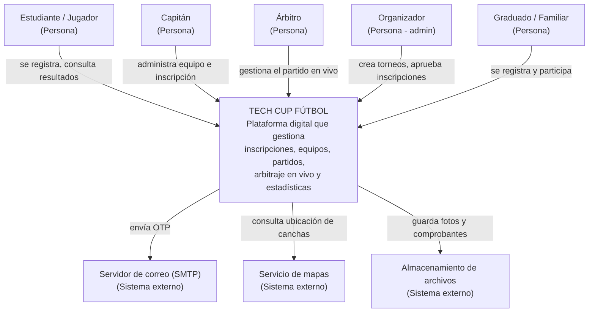

# TALLER_#6 — Planeación Ágil TECH CUP

Fuente: `TALLER_6_Planeacion_Agil_TechCup.docx`.

DOSW actúa como el equipo de gestión de proyecto del torneo TECH CUP
FÚTBOL: no desarrolla la plataforma, entrega un backlog completo en
Jira para que un equipo externo lo ejecute sin tener que preguntar
nada. Este documento es el contenido **listo para copiar en Jira**
(épica, features, tareas, sprints) y el diagrama C4 Nivel 1. Las 8
capturas de pantalla de Jira (C1-C7 y el link del proyecto) las debe
tomar el estudiante una vez cree el proyecto real en Jira — no se
pueden generar aquí.

> Nota de alcance: no se creó un proyecto Jira real ni se tomaron
> capturas (fuera del alcance de este asistente). Todo el contenido de
> abajo está redactado con el nivel de detalle que pide la rúbrica del
> taller, listo para pegarse directamente en Jira.

## 1. Diagrama C4 — Nivel 1: Contexto del sistema

Actores y sistemas externos identificados en el enunciado:

| Actor / Sistema | Tipo | Interacción con TECH CUP FÚTBOL |
|---|---|---|
| Estudiante / Jugador | Persona | Registro, perfil deportivo, búsqueda de equipo, consulta de resultados y estadísticas |
| Capitán | Persona (rol) | Crea y administra equipo, gestiona inscripción, alineaciones y jugadores |
| Árbitro | Persona | Gestiona el partido en vivo: tiempo, goles, tarjetas, sustituciones |
| Organizador | Persona (admin) | Crea torneos, aprueba inscripciones, gestiona árbitros, ve el dashboard |
| Graduado / Familiar | Persona | Se registra con correo Gmail, participa como jugador o capitán |
| Servidor de correo (SMTP) | Sistema externo | Envío de códigos OTP para registro, login y acciones sensibles |
| Servicio de mapas | Sistema externo | Muestra ubicación de canchas en el campus |
| Almacenamiento de archivos | Sistema externo | Guarda fotos de perfil, escudos de equipo y comprobantes de pago |

Diagrama (Mermaid — sirve como base para exportarlo o adaptarlo a
draw.io con la plantilla C4 que pide el enunciado):

Instrucciones para pasarlo a draw.io (según el enunciado):
rectángulo central "TECH CUP FÚTBOL" con descripción de una línea,
cada actor como figura separada, flechas etiquetadas con
dirección/propósito, leyenda persona vs. sistema externo. Guardar el
`.drawio` en `docs/uml/` del repositorio real del proyecto (no de
esta bitácora).

## 2. Épica — TCH-EPIC-01

| Campo | Contenido |
|---|---|
| Código | TCH-EPIC-01 |
| Nombre | Plataforma digital TECH CUP FÚTBOL |
| Fecha de inicio | 08/08/2026 — Sprint 1 |
| Fecha de cierre | 01/10/2026 — cierre del Sprint 7 |
| Propietario (DOSW) | (nombre del estudiante que gestiona la épica en Jira) |
| Problema que resuelve | El torneo semestral se organiza con WhatsApp, formularios y hojas de cálculo, lo que genera retrasos, errores de inscripción, resultados inconsistentes y mal manejo de la logística. |
| Objetivo | Diseñar e implementar una plataforma web centralizada que gestione el ciclo completo del torneo: inscripciones, equipos, partidos, arbitraje en vivo, estadísticas y comunicaciones. |
| Alcance incluido | Identidad y autenticación · Perfil deportivo · Equipos · Torneos e inscripciones · Calendario · Competencia y alineaciones · Arbitraje en vivo · Logística · Estadísticas · Comunicaciones · Dashboard del organizador |
| Alcance excluido | Pagos en línea dentro de la plataforma · Torneos de otros deportes · Aplicación móvil nativa · Integración con sistemas externos de la Escuela |
| Criterios de éxito | ✓ El torneo puede gestionarse completamente sin hojas de cálculo. ✓ El árbitro puede gestionar un partido en vivo desde un celular. ✓ Todos los actores completan su flujo principal sin asistencia. ✓ La plataforma cumple WCAG 2.1 AA. |

## 3. Mapa de features

| Código | Nombre del feature | TCH-RF relacionado | Sprint sugerido |
|---|---|---|---|
| FEAT-01 | Registro e identidad de usuarios | TCH-RF-01 (Identidad) | Sprint 1 |
| FEAT-02 | Perfil deportivo y gestión de jugadores | TCH-RF-02 (Usuarios) | Sprint 2 |
| FEAT-03 | Creación y administración de equipos | TCH-RF-03 (Equipos) | Sprint 2 |
| FEAT-04 | Inscripción al torneo y verificación de pago | TCH-RF-04 | Sprint 3 |
| FEAT-05 | Gestión del torneo y calendario de partidos | TCH-RF-05 | Sprint 3 |
| FEAT-06 | Alineaciones y competencia | TCH-RF-06 | Sprint 3-4 |
| FEAT-07 | Módulo de arbitraje en vivo | TCH-RF-07 | Sprint 4 |
| FEAT-08 | Logística (refrigerios y dotación) | TCH-RF-08 | Sprint 4 |
| FEAT-09 | Estadísticas individuales y por equipo | TCH-RF-09 | Sprint 5 |
| FEAT-10 | Comunicaciones y chats | TCH-RF-10 | Sprint 5 |
| FEAT-11 | Llaves eliminatorias y tabla de posiciones | TCH-RF-11 | Sprint 5-6 |
| FEAT-12 | Dashboard del organizador | TCH-RF-12 | Sprint 6 |
| FEAT-INF-01 | Configuración del repositorio y GitHub Flow | — | Sprint 1 |
| FEAT-INF-02 | Documentación técnica (README, arquitectura, APIs) | — | Sprint 1 y 7 |
| FEAT-INF-03 | Manual de identidad visual TECH CUP | — | Sprint 1 |
| FEAT-INF-04 | Configuración de Jira (épica, features, sprints, tablero) | — | Sprint 1 |
| FEAT-INF-05 | Presentación final y demo del sistema | — | Sprint 7 |

## 4. Features documentados (HU + criterios de aceptación)

Cada feature va como un issue tipo *Feature*, hijo de TCH-EPIC-01. Las
HU **no** son issues separados en Jira: van dentro de la descripción
del feature.

### FEAT-01 — Registro e identidad de usuarios
Épica: TCH-EPIC-01 · Sprint 1 (08/08–14/08/2026)

**Descripción / HU**
- Como estudiante, quiero registrarme con mi correo institucional o
  Gmail, para poder acceder a la plataforma del torneo.
- Como usuario, quiero recibir un código OTP por correo, para
  verificar que la cuenta me pertenece antes de activarla.

**Criterios de aceptación**
- ✓ Dado que un usuario ingresa un correo institucional o Gmail no
  registrado, cuando envía el formulario de registro, entonces el
  sistema crea la cuenta en estado INACTIVO y envía un OTP.
- ✓ Dado que un usuario ingresa el OTP correcto dentro de los 10
  minutos, cuando lo confirma, entonces la cuenta pasa a ACTIVA.
- ✗ Dado que un usuario ingresa un correo ya registrado, cuando envía
  el formulario, entonces el sistema rechaza y muestra "Este correo
  ya está registrado".

**Puntos estimados**: 8 (suma de TASK-01 a TASK-07, ver sección 5).

### FEAT-02 — Perfil deportivo y gestión de jugadores
Épica: TCH-EPIC-01 · Sprint 2 (15/08–21/08/2026)

**Descripción / HU**
- Como jugador, quiero crear mi perfil deportivo (posición, edad,
  foto), para que los capitanes puedan encontrarme y reclutarme.
- Como jugador, quiero editar mi perfil deportivo en cualquier
  momento, para mantener mis datos actualizados.

**Criterios de aceptación**
- ✓ Dado que un jugador con cuenta activa completa su perfil
  deportivo, cuando lo guarda, entonces queda visible en la búsqueda
  de jugadores.
- ✓ Dado que un jugador edita un campo de su perfil, cuando confirma
  el cambio, entonces el sistema actualiza el dato sin duplicar el
  perfil.
- ✗ Dado que un jugador deja el campo posición vacío, cuando intenta
  guardar, entonces el sistema rechaza y muestra "La posición es
  obligatoria".

**Puntos estimados**: 5.

### FEAT-03 — Creación y administración de equipos
Épica: TCH-EPIC-01 · Sprint 2 (15/08–21/08/2026)

**Descripción / HU**
- Como capitán, quiero crear un equipo con nombre y escudo, para
  poder inscribirlo al torneo.
- Como capitán, quiero agregar y remover jugadores de mi equipo, para
  mantener actualizada la plantilla antes del cierre de inscripciones.

**Criterios de aceptación**
- ✓ Dado que un usuario con rol Capitán crea un equipo con nombre
  único, cuando lo guarda, entonces el equipo queda disponible para
  agregar jugadores.
- ✓ Dado que un capitán agrega un jugador ya registrado en la
  plataforma, cuando confirma, entonces el jugador aparece en la
  plantilla del equipo.
- ✗ Dado que un capitán intenta crear un equipo con un nombre ya
  usado en el mismo torneo, cuando lo guarda, entonces el sistema
  rechaza y muestra "Ya existe un equipo con ese nombre".

**Puntos estimados**: 6.

### FEAT-04 — Inscripción al torneo y verificación de pago
Épica: TCH-EPIC-01 · Sprint 3 (22/08–28/08/2026)

**Descripción / HU**
- Como capitán, quiero inscribir mi equipo a un torneo adjuntando el
  comprobante de pago, para asegurar el cupo de mi equipo.
- Como organizador, quiero revisar y aprobar/rechazar los
  comprobantes de pago, para confirmar qué equipos quedan inscritos.

**Criterios de aceptación**
- ✓ Dado que un capitán sube un comprobante en un formato válido
  (PDF/imagen), cuando lo envía, entonces la inscripción queda en
  estado PENDIENTE_REVISION.
- ✓ Dado que un organizador aprueba un comprobante, cuando confirma,
  entonces el equipo pasa a estado INSCRITO y aparece en el
  calendario del torneo.
- ✗ Dado que un capitán intenta inscribirse después de la fecha
  límite del torneo, cuando lo intenta, entonces el sistema rechaza y
  muestra "El plazo de inscripción ha finalizado".

**Puntos estimados**: 8.

### FEAT-05 — Gestión del torneo y calendario de partidos
Épica: TCH-EPIC-01 · Sprint 3 (22/08–28/08/2026)

**Descripción / HU**
- Como organizador, quiero crear un torneo con fechas y sede, para
  poder abrir las inscripciones de los equipos.
- Como jugador o capitán, quiero consultar el calendario de partidos
  de mi equipo, para saber cuándo y dónde debo presentarme.

**Criterios de aceptación**
- ✓ Dado que un organizador crea un torneo con fecha de inicio y
  cierre válidas, cuando lo guarda, entonces el torneo queda visible
  para recibir inscripciones.
- ✓ Dado que un torneo tiene equipos inscritos, cuando el organizador
  publica el calendario, entonces cada equipo puede ver sus partidos
  asignados.
- ✗ Dado que un organizador intenta crear un torneo con fecha de
  cierre anterior a la fecha de inicio, cuando lo guarda, entonces el
  sistema rechaza y muestra "La fecha de cierre debe ser posterior al
  inicio".

**Puntos estimados**: 8.

### FEAT-06 — Alineaciones y competencia
Épica: TCH-EPIC-01 · Sprint 3-4

**Descripción / HU**
- Como capitán, quiero definir la alineación titular de mi equipo
  antes de cada partido, para que el árbitro sepa quiénes juegan.
- Como capitán, quiero hacer sustituciones durante el partido, para
  ajustar la estrategia del equipo.

**Criterios de aceptación**
- ✓ Dado que un capitán define una alineación con el número mínimo de
  jugadores requeridos, cuando la guarda, entonces queda lista para
  el partido.
- ✓ Dado que un partido está en curso, cuando el capitán registra una
  sustitución, entonces el árbitro ve el cambio reflejado en tiempo
  real.
- ✗ Dado que un capitán intenta alinear un jugador no inscrito en el
  equipo, cuando lo intenta, entonces el sistema rechaza y muestra
  "El jugador no pertenece a este equipo".

**Puntos estimados**: 8.

### FEAT-07 — Módulo de arbitraje en vivo
Épica: TCH-EPIC-01 · Sprint 4 (29/08–04/09/2026)

**Descripción / HU**
- Como árbitro, quiero registrar goles, tarjetas y el tiempo del
  partido desde mi celular, para llevar el marcador oficial en vivo.
- Como jugador o asistente, quiero ver el marcador del partido
  actualizado en tiempo real, para seguir el resultado sin estar en
  la cancha.

**Criterios de aceptación**
- ✓ Dado que un árbitro registra un gol de un jugador válido, cuando
  lo confirma, entonces el marcador se actualiza y es visible para
  todos los usuarios.
- ✓ Dado que un partido llega al tiempo reglamentario, cuando el
  árbitro lo finaliza, entonces el sistema bloquea nuevos registros
  de eventos para ese partido.
- ✗ Dado que un árbitro intenta registrar un gol de un jugador que no
  está alineado, cuando lo intenta, entonces el sistema rechaza y
  muestra "El jugador no está en la alineación del partido".

**Puntos estimados**: 8.

### FEAT-08 — Logística (refrigerios y dotación)
Épica: TCH-EPIC-01 · Sprint 4 (29/08–04/09/2026)

**Descripción / HU**
- Como organizador, quiero registrar la entrega de refrigerios y
  dotación por equipo, para controlar el gasto logístico del torneo.
- Como capitán, quiero consultar qué dotación ya recibió mi equipo,
  para reclamar lo pendiente.

**Criterios de aceptación**
- ✓ Dado que un organizador registra la entrega de dotación a un
  equipo, cuando lo confirma, entonces queda un registro con fecha y
  responsable.
- ✓ Dado que un capitán consulta el estado de dotación de su equipo,
  cuando lo abre, entonces ve lo entregado y lo pendiente.
- ✗ Dado que un organizador intenta registrar una entrega duplicada
  el mismo día, cuando lo intenta, entonces el sistema advierte "Ya
  se registró una entrega hoy para este equipo".

**Puntos estimados**: 5.

### FEAT-09 — Estadísticas individuales y por equipo
Épica: TCH-EPIC-01 · Sprint 5 (05/09–11/09/2026)

**Descripción / HU**
- Como jugador, quiero ver mis estadísticas acumuladas (goles,
  tarjetas, partidos jugados), para conocer mi desempeño en el torneo.
- Como organizador, quiero ver el ranking de goleadores del torneo,
  para publicarlo al finalizar cada fecha.

**Criterios de aceptación**
- ✓ Dado que un partido finaliza con eventos registrados, cuando el
  sistema los procesa, entonces las estadísticas de cada jugador
  involucrado se actualizan automáticamente.
- ✓ Dado que existen estadísticas de al menos un partido, cuando un
  organizador abre el ranking de goleadores, entonces lo ve ordenado
  de mayor a menor cantidad de goles.
- ✗ Dado que un partido aún no ha finalizado, cuando se consulta el
  ranking, entonces sus eventos no cuentan en las estadísticas
  todavía.

**Puntos estimados**: 6.

### FEAT-10 — Comunicaciones y chats
Épica: TCH-EPIC-01 · Sprint 5 (05/09–11/09/2026)

**Descripción / HU**
- Como capitán, quiero enviar un mensaje a todos los jugadores de mi
  equipo, para coordinar horarios y logística.
- Como organizador, quiero enviar comunicados generales a todos los
  equipos inscritos, para avisar cambios del torneo.

**Criterios de aceptación**
- ✓ Dado que un capitán escribe un mensaje en el chat de su equipo,
  cuando lo envía, entonces todos los jugadores del equipo lo reciben.
- ✓ Dado que un organizador publica un comunicado general, cuando lo
  envía, entonces llega a todos los capitanes de equipos inscritos.
- ✗ Dado que un usuario sin equipo intenta escribir en un chat de
  equipo, cuando lo intenta, entonces el sistema rechaza el envío.

**Puntos estimados**: 6.

### FEAT-11 — Llaves eliminatorias y tabla de posiciones
Épica: TCH-EPIC-01 · Sprint 5-6

**Descripción / HU**
- Como organizador, quiero generar automáticamente las llaves
  eliminatorias a partir de la fase de grupos, para avanzar el torneo
  sin cálculos manuales.
- Como jugador o capitán, quiero ver la tabla de posiciones
  actualizada, para saber si mi equipo avanza de fase.

**Criterios de aceptación**
- ✓ Dado que la fase de grupos ha finalizado con todos los resultados
  registrados, cuando el organizador genera las llaves, entonces el
  sistema arma los cruces según la posición de cada equipo.
- ✓ Dado que un partido de fase de grupos finaliza, cuando se
  registra el resultado, entonces la tabla de posiciones se
  recalcula automáticamente.
- ✗ Dado que quedan partidos de la fase de grupos sin jugar, cuando
  el organizador intenta generar las llaves, entonces el sistema
  rechaza y muestra "Aún hay partidos pendientes en la fase de
  grupos".

**Puntos estimados**: 8.

### FEAT-12 — Dashboard del organizador
Épica: TCH-EPIC-01 · Sprint 6 (12/09–18/09/2026)

**Descripción / HU**
- Como organizador, quiero ver en un solo panel el estado general del
  torneo (equipos inscritos, partidos jugados, incidencias), para
  tomar decisiones rápidas.
- Como organizador, quiero filtrar el dashboard por torneo activo,
  para no mezclar información de torneos distintos.

**Criterios de aceptación**
- ✓ Dado que existen datos de al menos un torneo activo, cuando el
  organizador abre el dashboard, entonces ve equipos inscritos,
  partidos jugados y pendientes en un solo panel.
- ✓ Dado que hay más de un torneo en la plataforma, cuando el
  organizador selecciona un filtro de torneo, entonces el dashboard
  muestra solo los datos de ese torneo.
- ✗ Dado que no hay ningún torneo activo, cuando el organizador abre
  el dashboard, entonces el sistema muestra un estado vacío con el
  mensaje "No hay torneos activos".

**Puntos estimados**: 6.

### Features de infraestructura (FEAT-INF-01 a 05)

| Código | Descripción / HU | Criterios de aceptación | Puntos |
|---|---|---|---|
| FEAT-INF-01 | Como equipo de desarrollo, quiero un repositorio configurado con GitHub Flow, para poder trabajar en paralelo sin pisar el código de otros. | ✓ Dado que se crea el repo, cuando se configura, entonces existen las ramas main/develop protegidas y la convención feature/FEAT-XX. ✗ Dado que alguien intenta hacer push directo a main, entonces el sistema lo rechaza sin PR aprobado. | 2 |
| FEAT-INF-02 | Como desarrollador nuevo en el equipo, quiero documentación técnica (README, arquitectura, APIs), para entender el sistema sin preguntarle a nadie. | ✓ Dado que el README existe, cuando un desarrollador nuevo lo lee, entonces puede levantar el proyecto localmente sin ayuda. | 3 |
| FEAT-INF-03 | Como diseñador/desarrollador frontend, quiero un manual de identidad visual, para aplicar colores y tipografías consistentes en toda la plataforma. | ✓ Dado que el manual existe, cuando el frontend lo consulta, entonces encuentra paleta HEX, tipografías y logo en todas sus variantes. | 3 |
| FEAT-INF-04 | Como equipo DOSW, quiero el proyecto Jira configurado (épica, features, sprints, tablero), para que el backlog completo quede listo para el equipo de desarrollo. | ✓ Dado que el taller se completa, cuando se revisa Jira, entonces existen la épica, todos los features, los 7 sprints y el tablero Kanban del Sprint 1 activo. | 3 |
| FEAT-INF-05 | Como Comité Organizador, quiero una presentación final y demo del sistema, para validar que el proyecto cumple lo acordado. | ✓ Dado que llega la fecha de entrega (01/10/2026), cuando se presenta la demo, entonces se muestra el sistema funcionando en staging. | 3 |

## 5. Tareas técnicas de ejemplo

Escala: 1 punto = 1 día. Si una tarea supera 3 puntos, se divide en
subtareas más pequeñas.

### Tareas de FEAT-01 — Registro e identidad

| Código | Título | Descripción para el desarrollador | Pts |
|---|---|---|---|
| TASK-01 | Crear la entidad Usuario en PostgreSQL | Diseñar la tabla `usuarios` con: id (UUID), nombre_completo, correo (único), contraseña_hash, tipo_correo (INSTITUCIONAL/GMAIL), rol (JUGADOR/CAPITAN/ARBITRO/ORGANIZADOR), estado (ACTIVO/INACTIVO), fecha_creacion. Crear la entidad JPA y su repositorio Spring Data. | 1 |
| TASK-02 | Implementar el endpoint POST /api/v1/auth/register | Recibir: nombre, correo, contraseña. Validar: correo único, contraseña mínimo 8 caracteres (1 mayúscula, 1 número). Si pasa, guardar con contraseña hasheada (bcrypt) y disparar el OTP. Devolver 201 con confirmación o 400 con errores de validación. | 2 |
| TASK-03 | Implementar el servicio de envío de OTP | Generar código numérico de 6 dígitos, guardarlo en `otp_tokens` (correo, código hasheado, expiración 10 min). Enviarlo por JavaMailSender con plantilla HTML. Bloquear reenvío por 60 segundos. | 2 |
| TASK-04 | Implementar el endpoint POST /api/v1/auth/verify-otp | Recibir correo y código. Buscar el OTP más reciente no expirado. Si coincide: activar cuenta e invalidar el OTP (200). Si no: 400. Tras 3 intentos fallidos, bloquear el correo 5 minutos. | 2 |
| TASK-05 | Implementar el endpoint POST /api/v1/auth/login | Recibir correo y contraseña. Validar con bcrypt. Si es válida, generar JWT (payload: userId, rol, tipo_correo, exp 8h) y devolver 200. Si falla, 401. Registrar el evento en auditoría. | 2 |
| TASK-06 | Configurar Spring Security y el filtro JWT | Crear `JwtAuthenticationFilter`: intercepta cada request, extrae el Bearer token, lo valida (firma, expiración, formato) y carga el usuario en el SecurityContext. Rutas `/auth/**` públicas; el resto requiere token válido. | 3 |
| TASK-07 | Documentar los endpoints en Swagger/OpenAPI 3.0 | Agregar `@Operation`, `@ApiResponse`, `@RequestBody` con ejemplos de éxito y error para cada endpoint de autenticación. Verificar el Swagger UI en `/swagger-ui.html`. | 1 |

### Tareas de infraestructura

| Código | Feature | Tarea | Descripción para el desarrollador | Pts |
|---|---|---|---|---|
| TASK-I01 | FEAT-INF-01 | Crear el repositorio en GitHub | Crear `DOSW-TechCup-2026` en la organización. Inicializar con README, `.gitignore` Java/Maven y licencia MIT. Ramas: main (protegida, PR + 1 aprobación), develop (protegida), convención `feature/FEAT-XX-nombre`. | 1 |
| TASK-I02 | FEAT-INF-01 | Configurar el template de Pull Request | Crear `.github/pull_request_template.md` con checklist: descripción del cambio, issue relacionado, tipo (feature/fix/docs), pruebas realizadas, criterios de aceptación cumplidos. | 1 |
| TASK-I03 | FEAT-INF-03 | Definir la paleta de colores y tipografías | Basado en la sección 8 del enunciado (negro carbón #1B2A4A, dorado, morado). Crear `/docs/brand/brand-guide.md` con HEX, tipografías, tamaños mínimos de logo, ejemplos correctos/incorrectos. | 1 |
| TASK-I04 | FEAT-INF-03 | Diseñar el logo y variaciones del escudo | Logo en SVG en 3 versiones (completo, solo escudo, monocromático). Exportar PNG a 512x512, 256x256, 64x64. Guardar en `/docs/brand/logo/`. | 2 |
| TASK-I05 | FEAT-INF-02 | Crear el diagrama de arquitectura de microservicios | Modelar en draw.io los 9 microservicios (identidad, usuarios, equipos, torneos, competencia, logística, árbitro, estadísticas, comunicaciones) con API Gateway como entrada. Indicar conexiones, bases de datos (PostgreSQL/MongoDB) y protocolos (REST/WebSocket). Guardar en `/docs/architecture/`. | 2 |

Definición de terminado (por tarea, ejemplo general): prueba unitaria
pasando, endpoint documentado en Swagger (si aplica), PR aprobado por
al menos 1 revisor, sin conflictos con `develop`.

## 6. Planificación de sprints

7 sprints de 1 semana, del 8 de agosto al 1 de octubre de 2026.
Capacidad: 20 puntos por sprint (4 personas × 5 días); el Sprint 7
dura 2 semanas → 28 puntos.

| Sprint | Fechas | Foco | Features | Entregable clave | Cap. |
|---|---|---|---|---|---|
| Sprint 1 | 08/08–14/08/26 | Base del proyecto + identidad | FEAT-INF-01, FEAT-INF-02, FEAT-INF-03, FEAT-INF-04, FEAT-01 | Repositorio configurado, manual de identidad, Jira listo, registro + login con OTP funcional | 20 |
| Sprint 2 | 15/08–21/08/26 | Perfil deportivo y equipos | FEAT-02, FEAT-03 | Jugador crea su perfil deportivo. Capitán crea equipo y gestiona jugadores | 20 |
| Sprint 3 | 22/08–28/08/26 | Torneos, inscripción y alineaciones | FEAT-04, FEAT-05, FEAT-06 (parcial) | Organizador crea torneo. Capitán inscribe equipo con comprobante. Calendario visible | 20 |
| Sprint 4 | 29/08–04/09/26 | Competencia y arbitraje en vivo | FEAT-06 (cierre), FEAT-07, FEAT-08 | Capitán gestiona alineaciones. Árbitro opera el módulo en vivo. Logística registrada | 20 |
| Sprint 5 | 05/09–11/09/26 | Estadísticas, comunicaciones y llaves | FEAT-09, FEAT-10, FEAT-11 | Estadísticas automáticas. Chat de equipo. Llaves eliminatorias generadas | 20 |
| Sprint 6 | 12/09–18/09/26 | Dashboard y correcciones | FEAT-12, corrección de bugs S4-S5 | Dashboard del organizador. Bugs críticos corregidos. Pruebas de integración | 20 |
| Sprint 7 | 19/09–01/10/26 | Documentación final y demo | FEAT-INF-02 (cierre), FEAT-INF-05 | README completo. Arquitectura documentada. Presentación lista. Demo en staging. Entrega 01/10 | 28 |

Criterio de cierre sugerido por sprint (a completar en Jira con el
resultado real de cada sprint): "el sprint cierra exitosamente cuando
el 100% de las tareas comprometidas están en Done, el entregable
clave es demostrable en un ambiente de pruebas, y no quedan bugs
críticos abiertos del propio sprint".

## 7. Configuración en Jira — pasos y capturas pendientes

Orden de creación en Jira (los niveles superiores deben existir antes
que los inferiores):

1. Proyecto tipo Scrum con el nombre del equipo — **Captura C1**
2. Épica TCH-EPIC-01 con todos los campos — **Captura C2**
3. Todos los features como hijos de la épica — **Captura C3**
4. Tareas como Sub-tasks del feature (no de una HU) — **Captura C4**
5. Los 7 sprints con fechas exactas — **Captura C5**
6. Tareas distribuidas en los sprints (drag & drop desde el backlog) — **Captura C6**
7. Sprint 1 iniciado — **Captura C7**

Configuración de Story Points: Project Settings → Features → habilitar
Story Points; asignar 1/2/3 en cada Sub-task. Si un sprint supera los
20 puntos, mover tareas sobrantes al siguiente sprint.

> Pendiente del estudiante: crear el proyecto real en Jira, cargar
> este contenido (épica → features → tareas → sprints), tomar las 7
> capturas (C1-C7) y pegar el link del proyecto Jira aquí y en la
> bitácora (`README.md` raíz), tal como pide la diapositiva 41 de
> "DOSW 1 - S05.pptx": *"DEBE IR EN LA BITÁCORA EL LINK DE JIRA"*.

## 8. Criterios de evaluación (referencia)

| Actividad | Criterio | Pts |
|---|---|---|
| Diagrama C4 | Todos los actores, sistemas externos, flechas etiquetadas y límite del sistema claro | 10 |
| Épica en Jira | TCH-EPIC-01 con todos los campos: descripción, criterios de éxito, alcance incluido/excluido, fechas | 10 |
| Features documentados | Todos con HU en formato Como/quiero/para, mínimo 2 criterios Dado/Cuando/Entonces (uno de error), infraestructura incluida | 30 |
| Tareas descritas | Título con verbo en infinitivo, descripción ejecutable sin preguntas, puntos (1-3), definición de terminado | 20 |
| Sprints en Jira | 7 sprints con fechas correctas, distribución razonable, ningún sprint supera su capacidad, criterio de cierre definido | 10 |
| Capturas de Jira | Las 8 capturas presentes, legibles, muestran la estructura completa | 10 |
